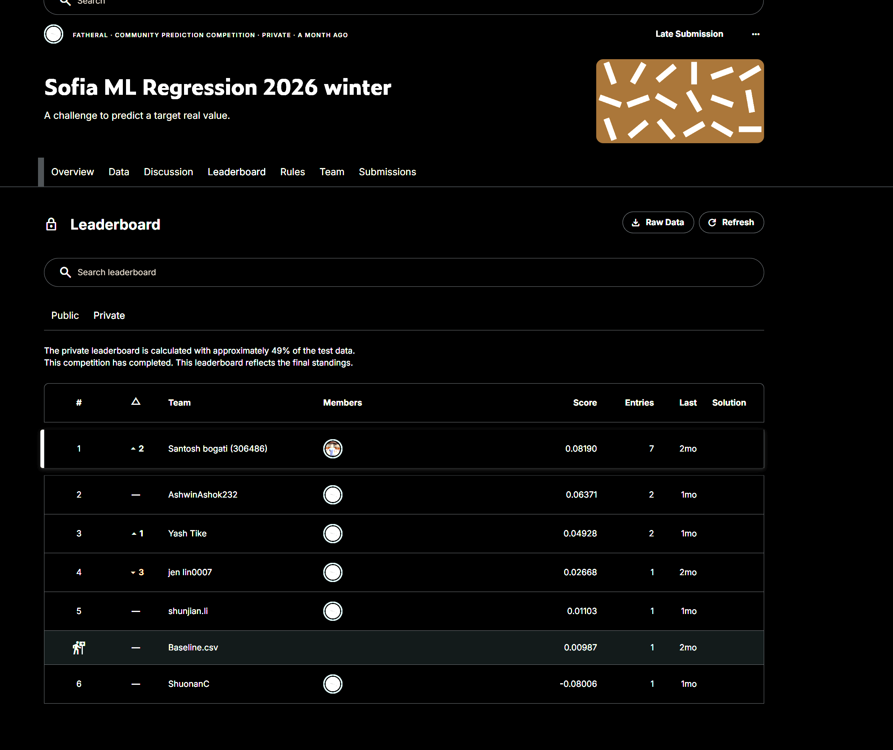

# Sofia ML Regression 2026 — #1 Private Leaderboard

[](https://github.com/phoenix1revv-risefromashes/ML-Kaggle-Competition-Winning/actions/workflows/ci.yml)

**Competition:** [Sofia ML Regression 2026 Winter](https://www.kaggle.com/competitions/sofia-ml-regression-2026-winter)  
**Kaggle profile:** [phoenix01revv](https://www.kaggle.com/phoenix01revv)

[](assets/kaggle-rank.png)

---

## The key insight

EDA revealed the dataset had two structurally different regimes:

- **~93% of rows** followed a linear relationship
- **~7% of rows** (outliers by IQR) followed a parabolic pattern: `target ≈ 5 × x1²`

A single model handles neither regime well. The solution treats them separately.

## Approach

**1. Preprocessing** — median imputation for missing values, IQR-based segmentation to split normal vs. extreme rows.

**2. Feature engineering** — squared all 15 features (x0²…x14²), bringing the total to 30. This lets a linear model fit the curved pattern in extreme rows without switching model families.

**3. Model** — Linear Regression trained on normal rows only, with StandardScaler for stability.

**4. Blending** — final prediction blends the learned model with the hand-derived formula:

```
ŷ = 0.9 × Linear Model + 0.1 × (5 × x1²)
```

The formula wasn't learned — it was derived from data inspection. That's what won it.

## Results

| Split | Score |
|---|---|
| Private leaderboard | **#1** |
| Cross-validation (RMSE) | ~0.0819 |
| Public leaderboard | Low — extreme rows absent from public test set |

The public/private gap was expected: the public leaderboard didn't include extreme rows, so the formula term had no impact there. The private set did — and that's where it mattered.

## Repository structure

```
├── Competition Submitted Notebook.ipynb   # full solution — EDA, feature engineering, training, submission
├── assets/
│   ├── kaggle-rank.png                    # leaderboard proof
│   └── Presentation of the ML Pipeline.pptx
├── .github/
│   └── workflows/
│       └── ci.yml                         # notebook validation CI
└── .gitignore
```

> Dataset not included per competition rules. Update the file paths in Section 2 of the notebook before running locally.
